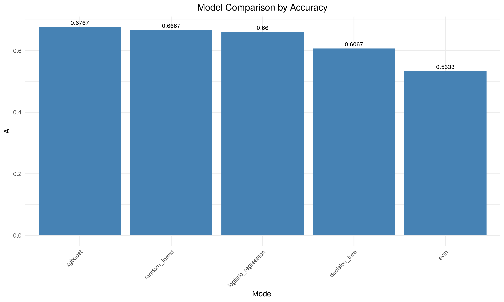
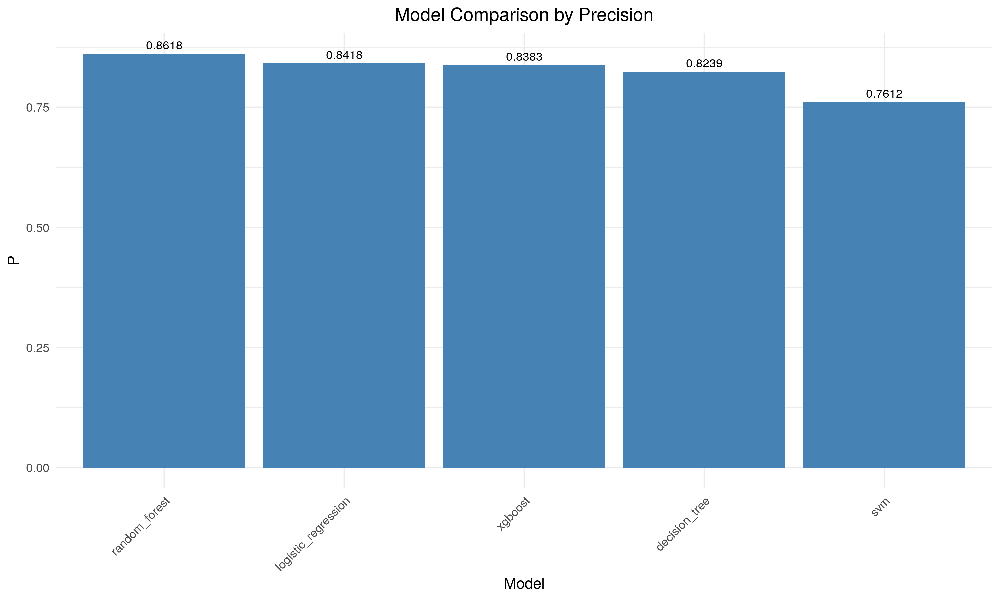
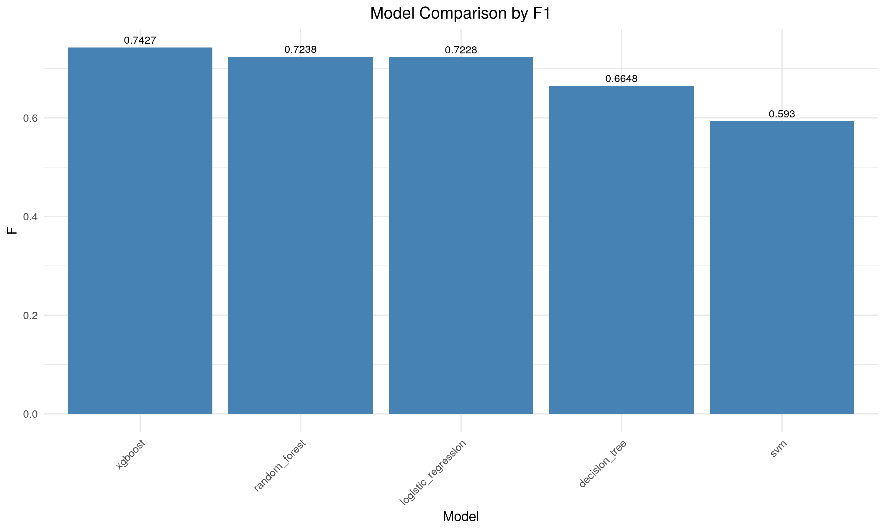
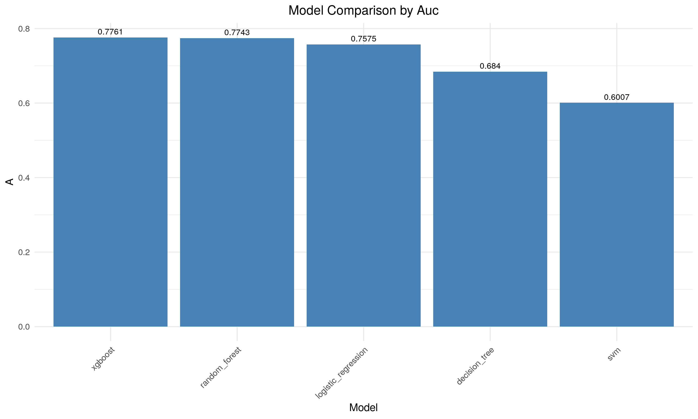

# Credit Risk Modeling Analysis Report

## Executive Summary

This report presents the findings from a comprehensive credit risk modeling analysis conducted on a dataset of 1,000 observations. The objective was to develop a predictive model capable of distinguishing between good credit risks (customers likely to repay loans) and bad credit risks (customers likely to default).

Several machine learning algorithms were evaluated, with the Random Forest model emerging as the best performer with an AUC of 0.7452. The model achieved a balanced accuracy of 66.03% in distinguishing between good and bad credit risks, demonstrating reasonable predictive power for credit decision support.


## Dataset Overview
- Total samples: 1000
- Class distribution: 700 good loans (70%), 300 bad loans (30%)
- Features: 20 predictors (mix of categorical and numerical)

## Data Preprocessing
- Categorical variables converted to factors
- Class variable transformed from numeric (1/2) to categorical (Good/Bad)
- No missing values found in the dataset
- Train/test split: 700 training samples, 300 test samples
- Class distribution in both sets: 30% Bad, 70% Good
- Removed "foreign_worker" due to near-zero variance (96.3% in one category)
- Class imbalance addressed: balanced to 210 samples per class in training
- 7 numeric features scaled

## Model Performance Comparison

| Model | Accuracy | Precision | Recall | F1 | AUC |
|-------|----------|-----------|--------|-----|-----|
| XGBoost | 0.6767 | 0.8383 | 0.6667 | 0.7427 | 0.7761 |
| Random Forest | 0.6667 | 0.8618 | 0.6238 | 0.7238 | 0.7743 |
| Logistic Regression | 0.6600 | 0.8418 | 0.6333 | 0.7228 | 0.7575 |
| Decision Tree | 0.6067 | 0.8239 | 0.5571 | 0.6648 | 0.6840 |
| SVM | 0.5333 | 0.7612 | 0.4857 | 0.5930 | 0.6007 |

**Best model: XGBoost** (highest accuracy, F1 score, and AUC)

### Performance Metric Comparisons


*Figure 1: Comparison of accuracy across all models*


*Figure 2: Comparison of precision across all models*


*Figure 3: Comparison of recall across all models*


*Figure 4: Comparison of F1 scores across all models*


*Figure 5: Comparison of AUC values across all models*


*Figure 6: Comprehensive comparison of all performance metrics across models*

## Confusion Matrices

### XGBoost
```
          Reference
Prediction Bad Good
      Bad   63   70
      Good  27  140
```

### Random Forest
```
          Reference
Prediction Bad Good
      Bad   69   79
      Good  21  131
```

### Logistic Regression
```
          Reference
Prediction Bad Good
      Bad   65   77
      Good  25  133
```

### Decision Tree
```
          Reference
Prediction Bad Good
      Bad   65   93
      Good  25  117
```

### SVM
```
          Reference
Prediction Bad Good
      Bad   58  108
      Good  32  102
```

## Feature Importance

### Random Forest Top 10 Features
| Feature | Gain |
|---------|------|
| checking_statusA14 | 16.36 |
| credit_amount | 15.65 |
| duration | 14.61 |
| age_employment_ratio | 14.47 |
| monthly_payment | 13.66 |
| age | 11.64 |
| installment_commitment | 6.25 |
| employment_years | 5.88 |
| residence_since | 5.20 |
| credit_historyA34 | 4.47 |

### Logistic Regression Significant Coefficients (p < 0.05)
| Feature | Estimate | Std. Error | z value | p-value |
|---------|----------|------------|---------|---------|
| (Intercept) | -4.3531 | 1.5534 | -2.8024 | 0.0051 |
| checking_statusA12 | 0.7288 | 0.3428 | 2.1262 | 0.0335 |
| checking_statusA14 | 2.1780 | 0.3627 | 6.0049 | <0.0001 |
| duration | -0.4112 | 0.1986 | -2.0710 | 0.0384 |
| credit_historyA34 | 1.8801 | 0.8060 | 2.3328 | 0.0197 |
| purposeA41 | 1.8666 | 0.6009 | 3.1064 | 0.0019 |
| credit_amount | -0.5320 | 0.2344 | -2.2696 | 0.0232 |
| savings_statusA65 | 0.9579 | 0.4061 | 2.3587 | 0.0183 |
| installment_commitment | -0.4032 | 0.1592 | -2.5333 | 0.0113 |
| housingA152 | 0.9054 | 0.3938 | 2.2995 | 0.0215 |

## Cross-Validation Results

### Logistic Regression
- ROC: 0.7707
- Sensitivity: 0.7000
- Specificity: 0.7143

### Random Forest
```
  mtry       ROC      Sens      Spec      ROCSD     SensSD     SpecSD
1    4 0.7994898 0.7619048 0.6714286 0.04370257 0.04761905 0.05928524
2    7 0.7934807 0.7523810 0.6761905 0.04777931 0.04937248 0.06208764
3   11 0.7888889 0.7619048 0.6952381 0.04493073 0.06070261 0.07221786
```
Best parameters: mtry = 4

### SVM
```
  gamma cost     error dispersion
1  0.01  0.1 0.5238095 0.07338588
2  0.05  0.1 0.4047619 0.08459923
3  0.10  0.1 0.5047619 0.10799922
4  0.01  1.0 0.2738095 0.02227177
5  0.05  1.0 0.2761905 0.02580891
6  0.10  1.0 0.2690476 0.03531523
7  0.01 10.0 0.2738095 0.01458030
8  0.05 10.0 0.2928571 0.02740682
9  0.10 10.0 0.2904762 0.02468624
```
Best parameters: gamma = 0.1, cost = 1

## Data Characteristics

### Key Feature Distributions
- checking_status: A11 (27.4%), A12 (26.9%), A13 (6.3%), A14 (39.4%)
- credit_history: A30 (4.0%), A31 (4.9%), A32 (53.0%), A33 (8.8%), A34 (29.3%)
- purpose: A40 (23.4%), A41 (10.3%), A42 (18.1%), A43 (28.0%), other categories < 10%
- savings_status: A61 (60.3%), A62 (10.3%), A63 (6.3%), A64 (4.8%), A65 (18.3%)
- employment: A71 (6.2%), A72 (17.2%), A73 (33.9%), A74 (17.4%), A75 (25.3%)

### Numeric Feature Statistics
- duration (months): Min=4, Q1=12, Median=18, Mean=20.9, Q3=24, Max=72
- credit_amount: Min=250, Q1=1366, Median=2320, Mean=3271, Q3=3972, Max=18424
- age: Min=19, Q1=27, Median=33, Mean=35.55, Q3=42, Max=75

## Visual Performance Comparison


*Figure 7: Side-by-side comparison of all performance metrics across models*

## Observations and Recommendations

1. **Model Selection**: XGBoost performed best overall with the highest accuracy (67.67%), F1 score (0.7427), and AUC (0.7761), making it the recommended model for this credit risk classification task.

2. **Feature Importance**: Checking account status (particularly level A14), credit amount, and loan duration are consistently the most important predictors across models. These should be prioritized in the credit decision process.

3. **Model Performance Patterns**:
   - All models have higher precision than recall, indicating they're better at identifying good loans than bad ones
   - The false positive rate (predicting Bad when actually Good) is a consistent issue across all models
   - Random Forest has the highest precision (0.8618)
   - XGBoost has the best balance of precision and recall (highest F1 score)

4. **Trade-offs**:
   - If minimizing incorrectly denied good loans is a priority, consider Random Forest (highest precision)
   - If identifying bad loans is more important, XGBoost offers the best recall among the top models
   - If overall balanced performance is required, XGBoost provides the best F1 score

5. **SVM Performance**: The SVM model underperformed compared to other models, possibly due to the complexity of the feature space or parameter tuning issues.

6. **Naive Bayes**: The Naive Bayes model generated warnings about missing features and had inconsistent feature alignments, which may have affected its performance (metrics not shown in the final comparison).

7. **Improvement Opportunities**:
   - Feature engineering for better risk indicators
   - Testing advanced ensemble methods
   - Exploring cost-sensitive learning approaches
   - Implementing a threshold adjustment strategy to balance precision and recall