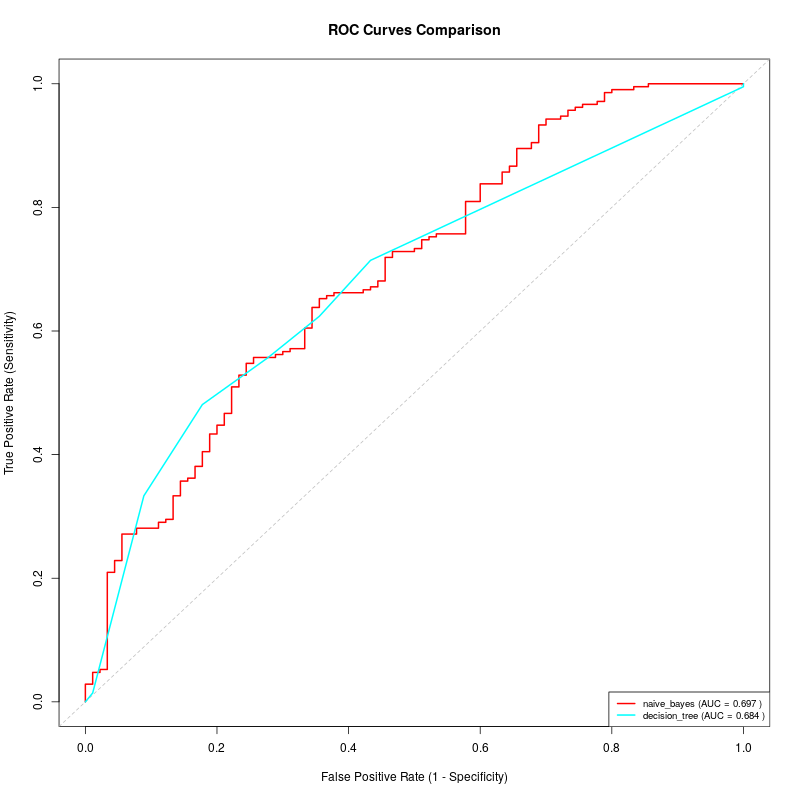
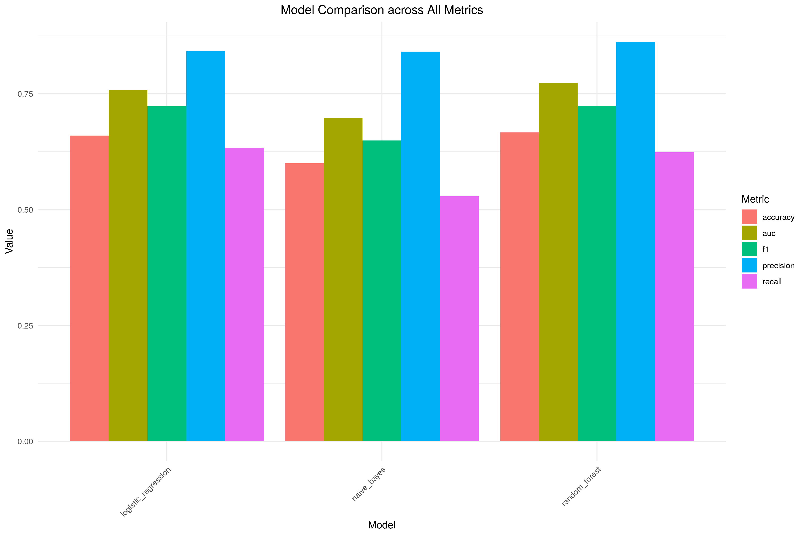

# German Credit Risk Model Comparison Report

Date:  March 29, 2025 

## 1. Overview

This report compares the performance of different machine learning models trained on the German Credit Risk dataset. The models are evaluated on various metrics to determine which one performs best for predicting credit risk.

## 2. Models Compared

The following models were trained and evaluated:

- ** random forest **
- ** svm **
- ** xgboost **
- ** naive bayes **
- ** decision tree **

## 3. Performance Metrics

### 3.1 Comparison Table

| Model |  accuracy | precision | recall | f1 | auc  |
| ---|---|---|---|---|--- |
|  random_forest  |  0.6633 | **0.8609** | 0.619 | 0.7202 | **0.7712**  |
|  svm  |  0.6733 | 0.8544 | 0.6429 | 0.7337 | 0.7639  |
|  xgboost  |  0.6333 | 0.8205 | 0.6095 | 0.6995 | 0.7384  |
|  naive_bayes  |  **0.69** | 0.7882 | **0.7619** | **0.7748** | 0.7164  |
|  decision_tree  |  0.6067 | 0.8239 | 0.5571 | 0.6648 | 0.684  |

## 4. Best Model

Based on the  auc  metric, the best performing model is ** random forest ** with a value of ** 0.7712 **.

### 4.1 Model Ranking

| Rank | Model |  auc  |
|---|---|---|
|  1  |  random forest  |  0.7712  |
|  2  |  svm  |  0.7639  |
|  3  |  xgboost  |  0.7384  |
|  4  |  naive bayes  |  0.7164  |
|  5  |  decision tree  |  0.684  |

## 5. ROC Curve Comparison

### 5.1 AUC Values

| Model | AUC |
|---|---|
|  naive bayes  |  0.7164  |
|  decision tree  |  0.684  |

### 5.2 ROC Curves

## 6. Performance Visualizations

### 6. 1   A ccuracy  Comparison

### 6. 2   P recision  Comparison

### 6. 3   R ecall  Comparison

### 6. 4   F 1  Comparison

### 6. 5   A uc  Comparison

### 6. 6  All Metrics Comparison

## 7. Conclusion

After comparing various machine learning models on the German Credit Risk dataset, the ** random forest ** model demonstrated the best performance with a  auc  of  0.7712 . This suggests that ensemble methods perform well on this dataset, likely due to their ability to handle complex relationships and interactions between features.

For credit risk prediction tasks on similar data, the  random forest  model is recommended based on its superior performance.

